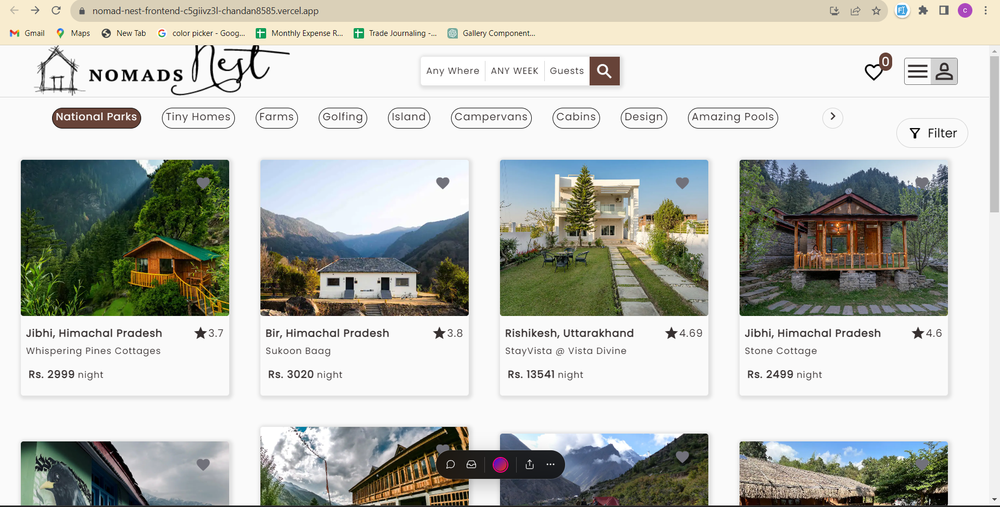
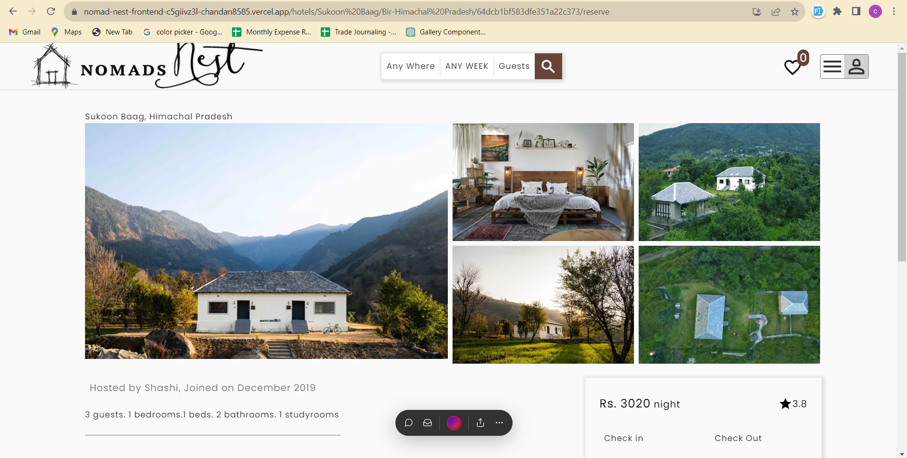
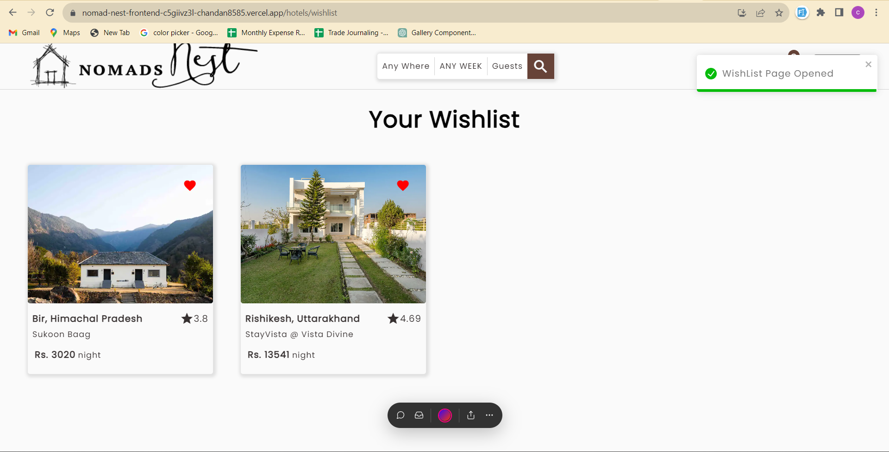
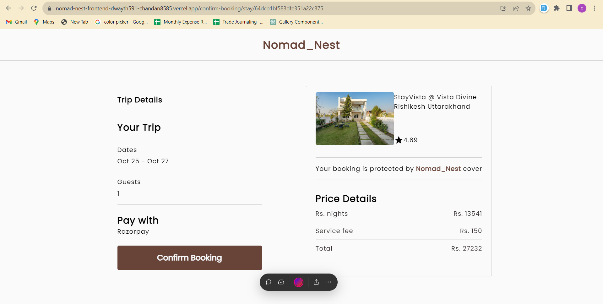
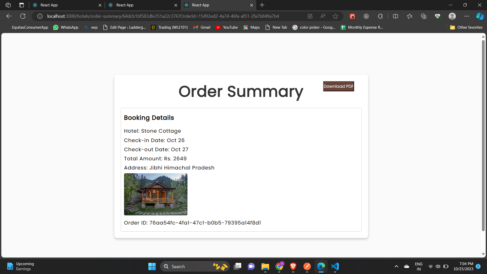

# Nomad_Nest 
 

A travel app that helps you discover Your Home Away From Home: The Ultimate Travel App for Seamless Rental Accommodation in your budget.Nomad_Nest App suggests you the best stays and enjoy your trip with range of best hotel and that too in budget prices, add your favourite hotel to wishlist can search your hotel category wise also provides gateway for instant payment to book your hotel.


## Features

- **Sleek Single-Page Application:** Enjoy a seamless user experience within a single page, ensuring efficiency and smooth navigation.

- **Robust Backend Powered by Express.js and Node.js:** The application's backend functionality is supported by Express.js and Node.js, providing a robust and responsive foundation.

- **Authentication Capabilities:** Utilize secure authentication features such as SignUp, Login, and Test Credentials to safeguard user data and ensure a safe environment.

- **Integrated React Date Component:** Benefit from the convenience of a React Date Component for easy and intuitive date selections within the application.

- **RazorPay Payment Gateway (Test Mode):** Seamlessly handle payments through the RazorPay gateway, ensuring secure transactions, even in the testing phase.

- **Efficient Database Management with MongoDB:** Database operations are handled seamlessly using MongoDB, ensuring reliable data storage and retrieval.

- **State Management with React Context and Reducer:** Employ React Context and Reducer to effectively manage the state of the application, enhancing user interaction and experience.

- **Dynamic Infinite Scrolling:** Implement Infinite Scroll functionality, allowing users to explore content continuously without interruptions.

- **Interactive Carousel for Categories:** Engage users with visually appealing carousels showcasing various categories, enhancing the presentation of content.

- **User-Friendly Dropdown Lists and Modals:** Improve user interaction with intuitive Dropdown Lists and Modals, ensuring a seamless and interactive interface.


- On the homepage, you will find the list of all the hotels that were listed on the webapp by hosts from all around the country. you can choose froom various categories listed.

 


# All The Pages
- Individual Hotel Pages, here you'll find the view of the hotel rooms and location type and amenities that will
be offered and breif description about the hotel.

 

- In Wishlist Page you can store all the hotels for your upcoming holidays.
 

- In Hotel Reservation Page which is linked with Razorpay payment gateway helps in booking your hotel.

 


- In Order Summary Page you will get your Booking Details.
 


## Tech Stack

**Client:** React, React-Context API, Html, CSSOpen Markdown Preview:

**Server:** Node, Express , MongoDB

## Author:

- Chandan Pratap
- [github](https://github.com/Chandan8585)
- [LinkedIn](https://www.linkedin.com/in/chandan-pratap-464386154/)
- [Twitter](https://twitter.com/chandanpra25704)


# Live Link
# Frontend Link

https://nomad-nest-frontend-git-datecomponent-chandan8585.vercel.app/

# Backend Link

https://nomad-nest.vercel.app/


## Running the App Locally
To get started with this project on your local machine, follow these simple steps:

- Clone the project using the following command in your terminal. Ensure that you have Git installed and added to your system's path.

```bash
  git clone git@github.com:Chandan8585/nomad_nest_frontend.git
```

- Navigate to the project directory:
```bash
  cd nomad_nest_frontend
```
- Install the required dependencies:
```bash
  npm install
```
- Start the server:
```bash
  npm run dev
```


